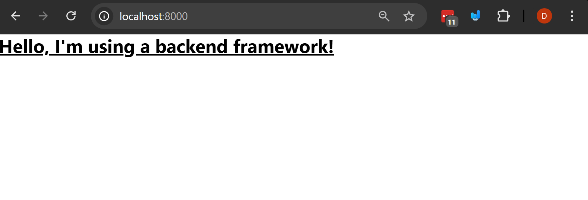
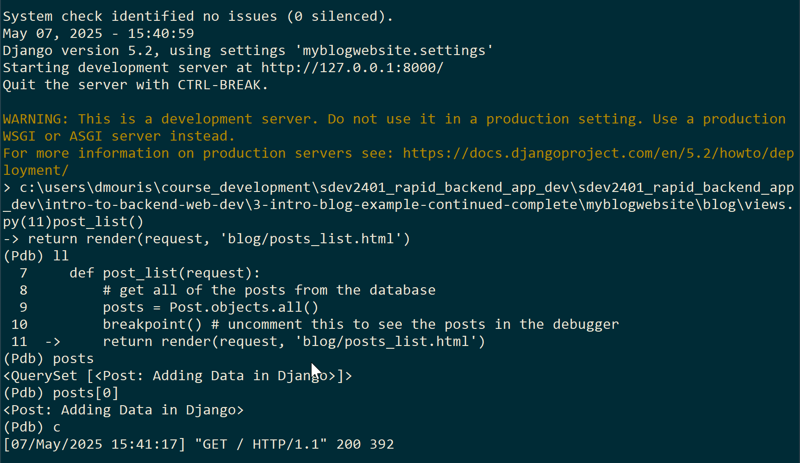
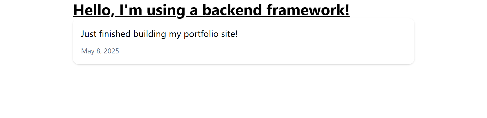
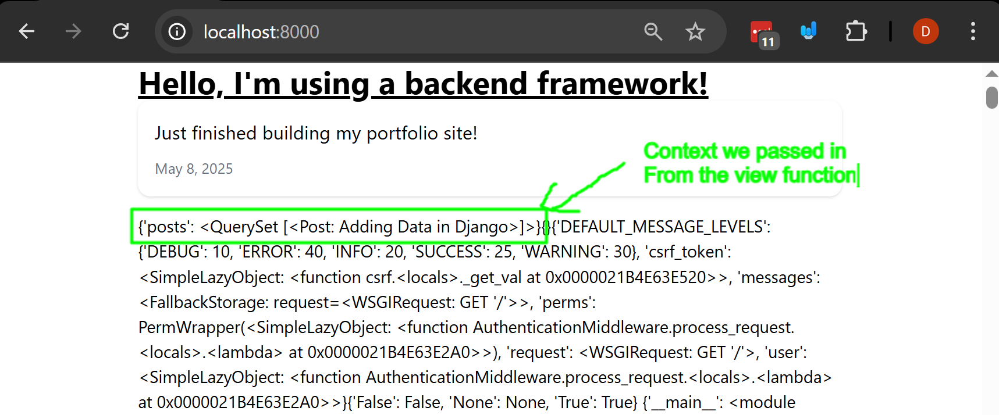
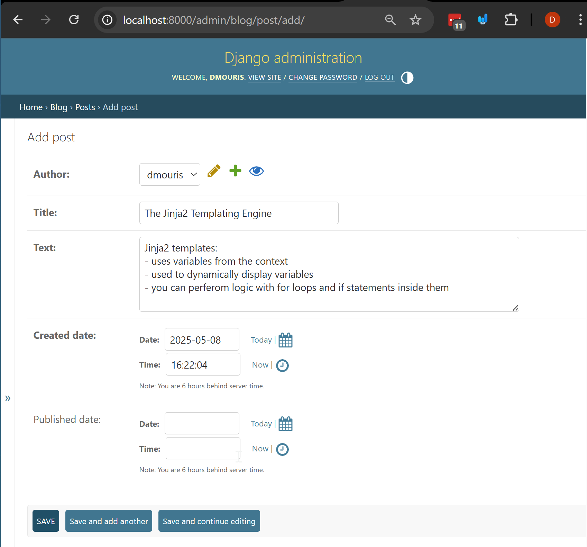
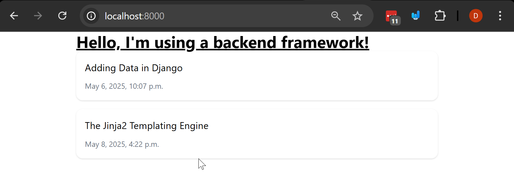
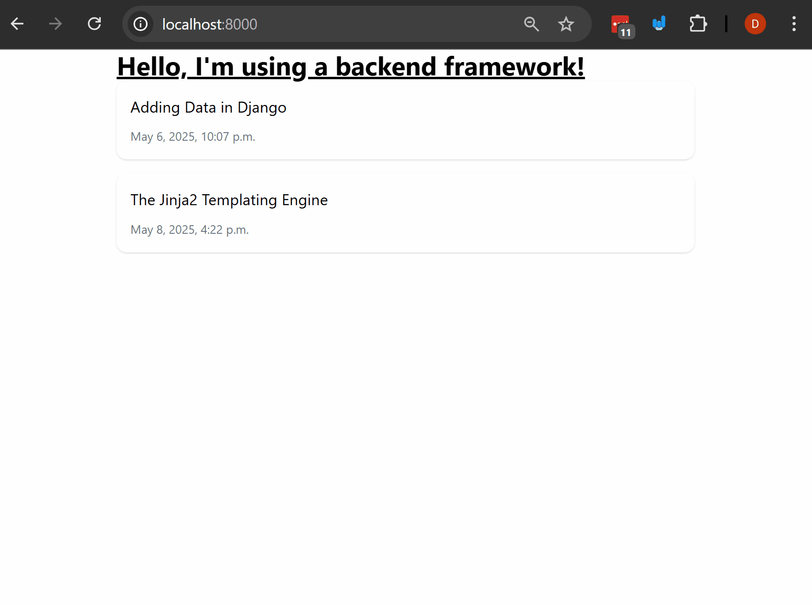

# Intro to Django and Backend Web Development fundamentals

In this example we'll be continuing the example from last class but we'll be going over concepts that we'll go into more detail throughout the course.

## Steps

### 1. Create a virtual envirnment and install Django
`python -m venv ./venv`

activate the virtual environment:
- linux/mac: `source ./venv/bin/activate`
- windows: `.\venv\Scripts\activate`

### 2. Install the requirements for the project from the requirements.txt file:
- check that you don't have the requirements installed already:
`pip freeze` this should show nothing if you just created the virtual environment.
- install the requirements:
`pip install -r requirements.txt`
- check that you have the requirements installed:
`pip freeze` this should show the requirements that are installed in the virtual environment.

### 3. Go into the `myblogwebsite` directory and run the server:
- navigate to the directory:
`cd myblogwebsite`
- run the migrations first to create the database:
`python manage.py migrate` this won't do anything if you don't have any migrations to run but it's a good idea to do this first.
- run the server:
`python manage.py runserver`

### 4. Let's create an HTML file (we'll be using the term template instead of HTML file) to the blog app.
- Create a new directory called `templates` in the `blog` directory, and a `blog` directory inside the `templates` directory.
- Let's add a new file called `posts_list.html` in the `blog/templates/blog` directory.
- Add the following code to the `posts_list.html` file:
```html
<!doctype html>
<html>
  <head>
    <meta charset="UTF-8" />
    <meta name="viewport" content="width=device-width, initial-scale=1.0" />
    <!-- This will be using tailwind for styling -->
    <script src="https://cdn.jsdelivr.net/npm/@tailwindcss/browser@4"></script>
  </head>
  <body>
    <div class="max-w-2xl mx-auto">
        <h1 class="text-3xl font-bold underline">
            Hello, I'm using a backend framework!
        </h1>
    </div>
  </body>
</html>
```
Note: you might be thinking how do we render this HTML file in the browser? Well, we need to create a view and a URL for it. We'll do that in the next step.

### 5. Let's create a view for the HTML template we just created.
- Open the `blog/views.py` file and add the following code to it:
```python

from django.shortcuts import render


# this is what will handle the request
def post_list(request):
    # note the following will render the template created.
    return render(request, 'blog/posts_list.html')
```
Notes:
  - The above is called a view. It handles a request and returns a response like we had discussed in our notes.
  - The `render` function takes the request and the template name as arguments and returns a response with the rendered template. Reference to the [Django documentation](https://docs.djangoproject.com/en/5.2/topics/http/shortcuts/#render).
  - The `request` object contains information about the request that was made to the server. We'll go into more detail in the course about this. Reference to the [Django documentation](https://docs.djangoproject.com/en/5.2/ref/request-response/#request-objects).

### 6. Let's create a `urls.py` file in the `blog` app directory and also add it to the `myblogwebsite/urls.py` file, so the project knows about it.
- Create a new file called `urls.py` in the `blog` directory and add the following code to it:
```python
from django.urls import path
from . import views

urlpatterns = [
    path('', views.post_list, name='post_list'),
]
```
- Note the above essentially uses the `post_list` view we created in the previous step and maps it to the root URL of the blog app. The `name` argument is used to give a name to the URL so we can refer to it later.
    - the `path` function takes the URL pattern, the view, and the name as arguments.
    - the `''` in the path function means that this URL will be the root URL of the blog app. So when we go to `http://localhost:8000/`, it will show the `post_list` view.
- Now we need to include this URL in the `myblogwebsite/urls.py` file. Open the `myblogwebsite/urls.py` file and change the code to the following:
```python
from django.contrib import admin
from django.urls import path, include

urlpatterns = [
    # the admin interface is available at /admin
    path("admin/", admin.site.urls),
    # include the blog app urls
    path("", include("blog.urls")),
]
```
- Note the `include` function is used to include the URLs from the blog app in the main project URLs. This allows us to keep the URLs for each app separate and organized.
- The `path` function is used to map the URL to the view we created in the previous step. The first argument is the URL pattern, the second argument is the view, and the third argument is the name of the URL.

### 7. Open the browser and go to `http://localhost:8000/` and you should see the HTML template we created in step 4.
- It should look something like this.


### 8. Let's load our Posts from the database and render them in the template.
- Remember from the last class we created a Post model in the `blog/models.py` file. We'll be using that to load the posts from the database and render them in the template.
- Open the `blog/views.py` file and change the code to the following:
```python
from django.shortcuts import render
# Below loads the Post model from the models.py file in the same directory
# Remember the . means "from the same directory" (relative import)
from .models import Post

# this is what will handle the request
def post_list(request):
    # get all of the posts from the database
    posts = Post.objects.all()
    # breakpoint() # uncomment this to see the posts in the debugger.
    return render(request, 'blog/posts_list.html', {'posts': posts})
    # the third argument is a dictionary that contains the context for the template.
```
- We're going to uncomment the `breakpoint()` line in the code above to see the posts in the debugger. This will allow us to see the posts that are loaded from the database and how they are rendered in the template.
  - Remember the `breakpoint()` function from last class. To get this to execute all you need to do is run the server and go to the URL in the browser. This will stop the server and allow you to see the posts in the debugger.
  - Below shows an example of what the posts look like in the debugger. 
  - comment (better yet remove) the `breakpoint()` line when you're done with it. This will allow the server to run normally and not stop at the breakpoint every time you go to the URL.

### 8. Let's update the `posts_list.html` file to dynamically render the posts using the Jinja2 template engine.
- The jinja2 template engine is used to render the HTML templates in Django. It allows us to use Python code in the templates and dynamically render the content.
- First let's update the `posts_list.html` file to have some html that will render the posts. Open the `posts_list.html` file and change the code to the following:
```html
<!doctype html>
<html>
  <head>
    <meta charset="UTF-8" />
    <meta name="viewport" content="width=device-width, initial-scale=1.0" />
    <script src="https://cdn.jsdelivr.net/npm/@tailwindcss/browser@4"></script>
    <title>Django, posts app</title>
  </head>
  <body>
    <div class="max-w-2xl mx-auto">
        <h1 class="text-3xl font-bold underline">
          Hello, I'm using a backend framework!
        </h1>
        <div class="bg-white shadow rounded-xl p-4 mb-4">
            <p class="text-lg mb-2">Just finished building my portfolio site!</p>
            <span class="text-sm text-gray-500">May 8, 2025</span>
        </div>
    </div>
  </body>
</html>
```
- The above code should look like this in the browser:


- We'll be exploring the Jinja2 template engine in more detail in the upcoming module of the course. Below the post add the `<p></p>` tag.
  - This is going to show you all of the context variables that are avialable in the template.
  - You should see something like the image below in the browser. In <span style="color: green;">green is the context we passed into the template</span> in the previous step. 
- Jinja2 uses the `` syntax to denote template tags.
  - The `` tag is used to show all of the context variables that are available in the template. This is useful for debugging and seeing what variables are available in the template.
  - The `` syntax is used to denote template tags in Jinja2. This allows us to use Python code in the templates and dynamically render the content.
  - The `{{ }}` syntax is used to denote template variables. This allows us to render the variables in the template and display them in the HTML.
- Now let's update the template to render the posts dynamically. Open the `posts_list.html` file and change the code to the following:
```html
<!doctype html>
<html>
  <head>
    <meta charset="UTF-8" />
    <meta name="viewport" content="width=device-width, initial-scale=1.0" />
    <script src="https://cdn.jsdelivr.net/npm/@tailwindcss/browser@4"></script>
    <title>Django, posts app</title>
  </head>
  <body>
    <div class="max-w-2xl mx-auto">
        <h1 class="text-3xl font-bold underline">
          Hello, I'm using a backend framework!
        </h1>
        
            <div class="bg-white shadow rounded-xl p-4 mb-4">
                <p class="text-lg mb-2">{{ post.title }}</p>
                <span class="text-sm text-gray-500">{{ post.created_date }}</span>
            </div>
        
    </div>
  </body>
</html>
```
- You can observe that the above uses a for loop to iterate over the posts.
  - The `` tag is used to iterate over the posts and render them in the template. The `post` variable is used to refer to each post in the loop.
  - Note: In jinja2 there's also an if statement that you can use to check if a variable is set or not. This is useful for checking if a variable is set before using it in the template.
  - Note: All templating language will have some sort of way to perform simple logic like for loops and if statements to display.

### 9. Let's add another post to the database and see it in the template.
- Open the admin interface in the browser at `http://localhost:8000/admin` and login with the superuser account you created in the last class.
- Go to the posts section, and add a new post 
- Go to the home page at `http://localhost:8000/` and you should see the new post rendered in the template 

### 10. Let's add a view to show the post details.
- Create a new file called `post_detail.html` in the `blog/templates/blog` directory and add the following code to it:
```html
<!doctype html>
<html>
  <head>
    <meta charset="UTF-8" />
    <meta name="viewport" content="width=device-width, initial-scale=1.0" />
    <script src="https://cdn.jsdelivr.net/npm/@tailwindcss/browser@4"></script>
    <title>Post Detail Page</title>
  </head>
  <body>
    <div class="max-w-2xl mx-auto">
        <h1 class="text-3xl font-bold underline">
          Post Detail Page
        </h1>
    </div>
  </body>
```
- Open the `blog/views.py` file and add the following code to it:
```python
from django.shortcuts import render, get_object_or_404
from .models import Post

# ... first post list function here ...

def post_detail(request, pk):
    # get the post with the given primary key (pk) from the database
    post = get_object_or_404(Post, pk=pk)
    return render(request, 'blog/post_detail.html', {'post': post})
```
- The above code uses the `get_object_or_404` function to get the post with the given primary key (pk) from the database. If the post is not found, it will return a 404 error.
  - The `pk` is the primary key of the post. This is used to uniquely identify the post in the database.
  - Note: just like your database class the  are automatically added to the model when you create it.

- Add the following code to the `blog/urls.py` file:
```python
from django.urls import path
from . import views

urlpatterns = [
    path('', views.post_list, name='post_list'),
    # post detail view below.
    path('post/<int:pk>/', views.post_detail, name='post_detail'),
]
```
- Update the `posts_list.html` file to add a link to the post detail page:
```html

    <div class="bg-white shadow rounded-xl p-4 mb-4">
        <a href="">
            <p class="text-lg mb-2">{{ post.title }}</p>
        </a>
        <span class="text-sm text-gray-500">{{ post.created_date }}</span>
    </div>

```
- The above code uses the `` tag to create a link to the post detail page. The `post.pk` is used to get the primary key of the post and pass it to the URL.

- Update the `post_detail.html` file to render the post details:
```html
<!doctype html>
<html>
  <head>
    <meta charset="UTF-8" />
    <meta name="viewport" content="width=device-width, initial-scale=1.0" />
    <script src="https://cdn.jsdelivr.net/npm/@tailwindcss/browser@4"></script>
    <title>{{ post.title }}</title>
  </head>
  <body>
    <div class="max-w-2xl mx-auto">
        <div class="max-w-3xl mx-auto mt-10 p-6 bg-white shadow-md rounded-lg">
            <h1 class="text-3xl font-bold text-gray-800 mb-4">{{ post.title }}</h1>
            <p class="text-sm text-gray-500 mb-6">Posted on {{ post.created_date }}</p>

            <div class="prose prose-lg text-gray-700">
                {{ post.text|linebreaks }}
            </div>
        </div>
    </div>
  </body>
</html>
```
- The above code uses the `{{ post.title }}` and `{{ post.text }}` to render the post title and text in the template. The `linebreaks` filter is used to convert newlines in the text to HTML line breaks.

### Conclusion

- In this example we focused on the following concepts:
   - Creating a view and a URL for the view.
   - Creating a template and rendering it in the view.
   - Using the Jinja2 template engine to render the template.
   - Using the `get_object_or_404` function to get a post from the database.
   - Using the `` tag to create a link to the post detail page.
   - Using the `linebreaks` filter to convert newlines in the text to HTML line breaks.
   - Using the `render` function to render the template with the context.
- We're going to go over these concepts in more detail in the upcoming module of the course.
- Here's a demo of the final product:
  
